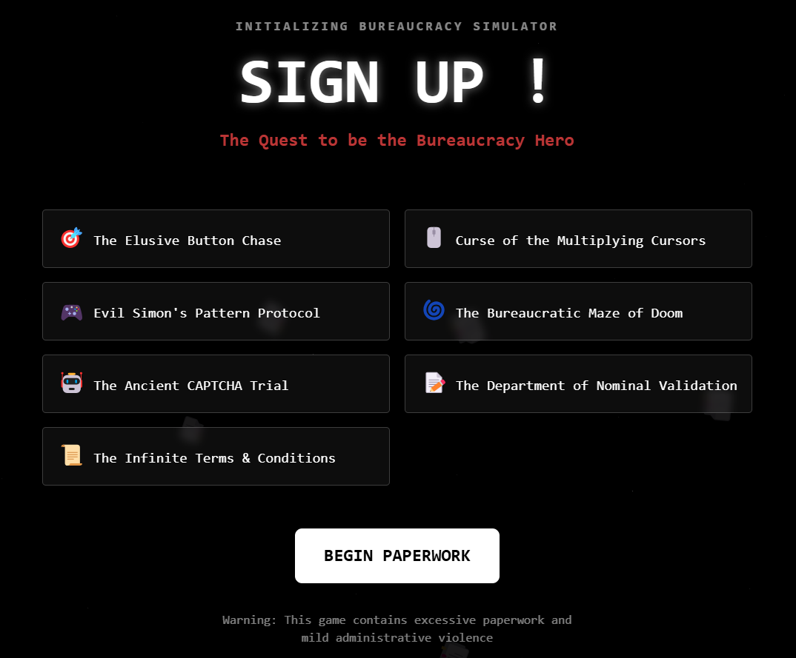
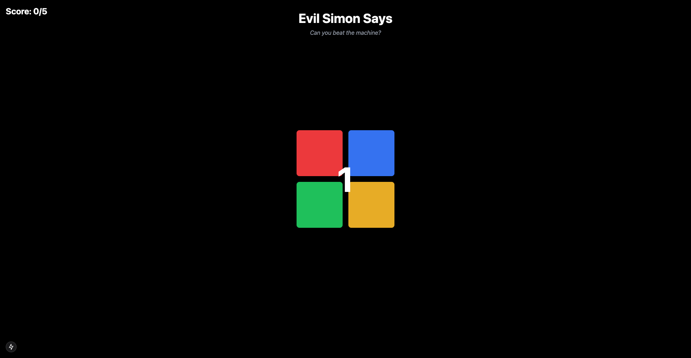
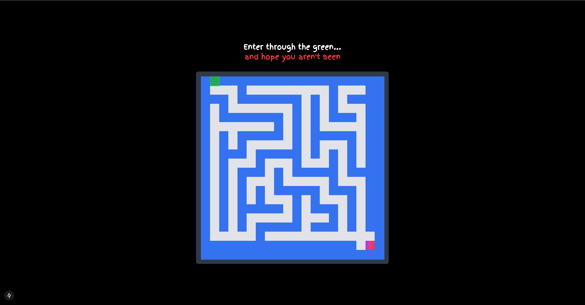
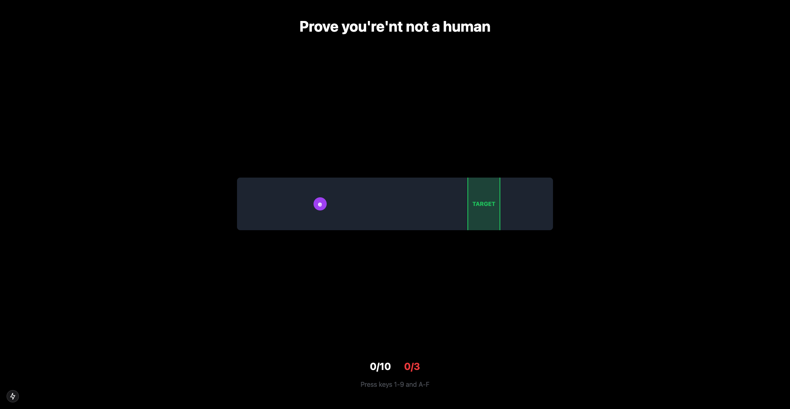
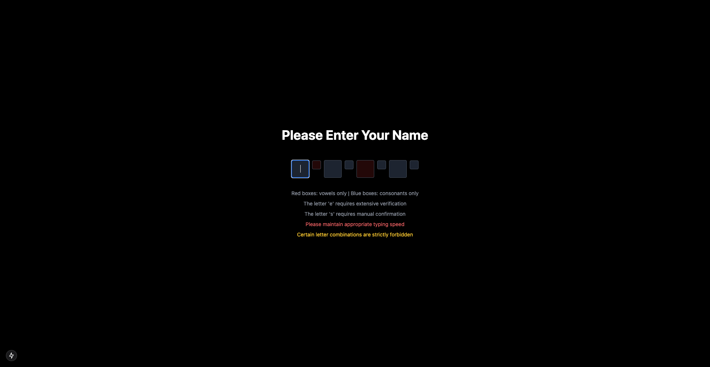
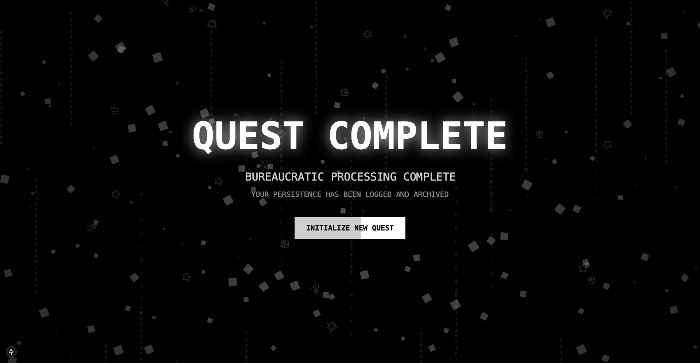

[![Contributors][contributors-shield]][contributors-url]
[![Forks][forks-shield]][forks-url]
[![Stargazers][stars-shield]][stars-url]
[![Issues][issues-shield]][issues-url]

<!-- PROJECT LOGO -->
 

  

<h2 align="center">Sign Up</h2>
  

    The Quest to be the Bureaucracy Hero
     
    <a href="https://github.com/provsalt/hnr2025-2/issues/new?labels=bug&template=bug-report---.md">Report Bug</a>
    ·
    <a href="https://github.com/provsalt/hnr2025-2/issues/new?labels=enhancement&template=feature-request---.md">Request Feature</a>
  

<!-- TABLE OF CONTENTS -->

  
Table of Contents

  <ol>
    <li>
      <a href="#about-the-project">About Sign Up</a>
      <ul>
        <li><a href="#built-with">Built With</a></li>
      </ul>
    </li>
    <li>
      <a href="#getting-started">Getting Started</a>
    </li>
    <li><a href="#levels">Levels</a></li>
    <li><a href="#contributing">Contributing</a></li>
    <li><a href="#contact">Contact</a></li>
    <li><a href="#acknowledgments">Acknowledgments</a></li>
  </ol>

<!-- ABOUT THE PROJECT -->

## About Sign Up

 

Embark on a hilariously absurd adventure through a corporate dystopia where paperwork is alive and bureaucracy reigns supreme. As Bob Johnson, a humble employee turned "The One Who Can Navigate The Forms," you'll decode CAPTCHA riddles, tame elusive submit buttons, and battle IT nightmares.

Do you have what it takes to become the legendary Bureaucracy Hero? Sign up now and take your first step into a world of checkbox challenges, printer battles, and sanity-testing terms and conditions!

(<a href="#readme-top">back to top</a>)

### Built With

- [![React][React.js]][React-url]
- [![TailwindCSS][TailwindCSS]][TailwindCSS-url]
- [![Next][Next.js]][Next-url]
- [![npm][Npm]][Npm-url]
- [![pnpm][pnpm]][pnpm-url]
- [![bun][Bun]][Bun-url]
- [Framer-motion][Motion-url]
- [Whisper][Whisper-url]

(<a href="#readme-top">back to top</a>)

<!-- GETTING STARTED -->

## Getting Started

1. Go to the [Sign Up website]()
2. Enjoy!

(<a href="#readme-top">back to top</a>)

<!-- LEVELS -->

## Levels

### Level 1: The Elusive Button Chase

Start your heroic journey by hunting down the "Submit" button that refuses to stay put. Quick reflexes and a keen eye are your only allies in this chaotic click-fest.

### Level 2: Curse of the Multiplying Cursors

An IT glitch gone rogue spawns endless cursors across your screen. Navigate through the confusion, avoid the decoy pointers, and use logic to identify the true cursor capable of completing your task. Can you outsmart the curse before your sanity splits?

### Level 3: Evil Simon's Pattern Protocol

Simon, the malevolent AI, guards the corporate server with an impenetrable memory game. Repeat its increasingly intricate patterns of blinking icons, but beware—every mistake adds a layer of bureaucracy to your challenge. Only those with perfect recall will survive.

### Level 4: The Bureaucratic Maze of Doom

Navigate a labyrinth of cubicles, filing cabinets, and coffee-stained memos as you search for the HR portal. Can you find the exit before your session times out?

### Level 5: The Ancient CAPTCHA Trial

Prove your worth in the ultimate test of patience and deciphering skill. Translate arcane symbols, squiggly text, and warped images in a CAPTCHA designed to weed out mere mortals. Failure is met with endless retries, but success brings you closer to the mythical Form 27B/6.

### Level 6: The Department of Nominal Validation

Enter a realm where your name must meet impossible standards. Adjust its spelling, format, and capitalization to appease the Validation Overlords. Only after countless rejections and vague error messages will you unlock the sacred approval stamp.

### Level 7: The Infinite Terms & Conditions

Scroll through an unending legal tome that seems to grow longer with every swipe. Hidden within are the magic words needed to proceed, but beware—the hypnotic monotony may consume you. Endurance and a willingness to read the fine print are your keys to victory.

### Completion

Congratulations, Bureaucracy Hero! After braving endless loops, cryptic CAPTCHAs, and the dreaded maze of corporate red tape, you’ve submitted Form 27B/6 and unlocked ultimate approval power.

The office celebrates your triumph (with a polite email, of course), and the prophecy is fulfilled. Your vacation request is granted—but beware, rumors of Form 42X/7 are already spreading…

(<a href="#readme-top">back to top</a>)

<!-- CONTRIBUTING -->

## Contributing

Contributions are what make the open source community such an amazing place to learn, inspire, and create. Any contributions you make are **greatly appreciated**.

If you have a suggestion that would make this better, please fork the repo and create a pull request. You can also simply open an issue with the tag "enhancement".
Don't forget to give the project a star! Thanks again!

1. Fork the Project
2. Create your Feature Branch (`git checkout -b feature/AmazingFeature`)
3. Commit your Changes (`git commit -m 'Add some AmazingFeature'`)
4. Push to the Branch (`git push origin feature/AmazingFeature`)
5. Open a Pull Request

(<a href="#readme-top">back to top</a>)

### Top contributors:

<!-- CONTACT -->

## Contact

Project Link: [https://github.com/provsalt/hnr2025-2](https://github.com/provsalt/hnr2025-2)

(<a href="#readme-top">back to top</a>)

<!-- ACKNOWLEDGMENTS -->

## Acknowledgments

Developed by Team Fast Fingers (Derrick, Fred, Raymond, Shiqi)

(<a href="#readme-top">back to top</a>)

<!-- MARKDOWN LINKS & IMAGES -->
<!-- https://www.markdownguide.org/basic-syntax/#reference-style-links -->

[contributors-shield]: https://img.shields.io/github/contributors/provsalt/hnr2025-2.svg?style=for-the-badge
[contributors-url]: https://github.com/provsalt/hnr2025-2/graphs/contributors
[forks-shield]: https://img.shields.io/github/forks/provsalt/hnr2025-2.svg?style=for-the-badge
[forks-url]: https://github.com/provsalt/hnr2025-2/network/members
[stars-shield]: https://img.shields.io/github/stars/provsalt/hnr2025-2.svg?style=for-the-badge
[stars-url]: https://github.com/provsalt/hnr2025-2/stargazers
[issues-shield]: https://img.shields.io/github/issues/provsalt/hnr2025-2.svg?style=for-the-badge
[issues-url]: https://github.com/provsalt/hnr2025-2/issues
[TailwindCSS]: https://img.shields.io/badge/Tailwind%20CSS-%2338B2AC.svg?logo=tailwind-css&logoColor=white
[TailwindCSS-url]: https://tailwindcss.com/
[React.js]: https://img.shields.io/badge/React-%2320232a.svg?logo=react&logoColor=%2361DAFB
[React-url]: https://reactjs.org/
[Next.js]: https://img.shields.io/badge/Next.js-black?logo=next.js&logoColor=white
[Next-url]: https://nextjs.org/
[Npm]: https://img.shields.io/badge/npm-CB3837?logo=npm&logoColor=fff
[Npm-url]: https://www.npmjs.com/
[Motion-url]: https://motion.dev/
[Whisper-url]: https://github.com/openai/whisper
[pnpm]: https://img.shields.io/badge/pnpm-F69220?logo=pnpm&logoColor=fff
[pnpm-url]: https://pnpm.io/
[Bun]: https://img.shields.io/badge/Bun-000?logo=bun&logoColor=fff
[Bun-url]: https://bun.sh/
